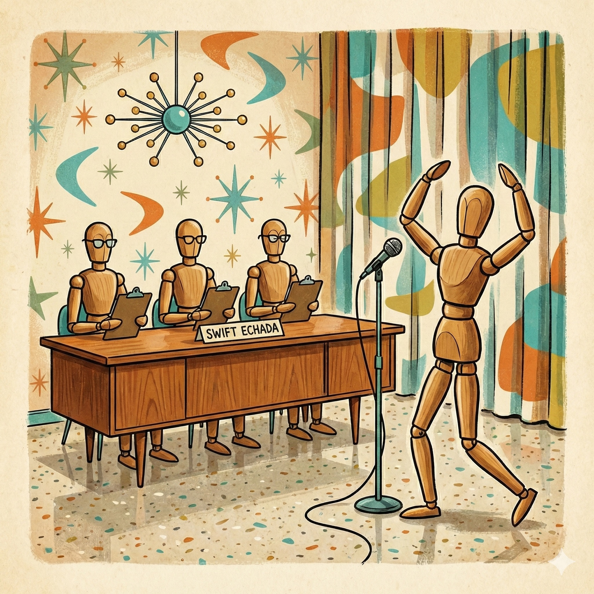

<p align="center">
  
</p>

# SwiftEchada

AI-powered cast management for screenplay projects. Extracts characters from screenplay files using local LLM inference (via [SwiftBruja](https://github.com/intrusive-memory/SwiftBruja)) and matches them to TTS voices.

## Requirements

- macOS 26+ (Apple Silicon)
- Swift 6.2+
- **MLX framework** (via Homebrew)

### Install MLX

SwiftEchada requires the MLX framework for on-device LLM inference:

```bash
brew install mlx
```

This installs the compiled Metal shader library (`mlx.metallib`) required for GPU acceleration.

**Important for CLI usage**: After building the `echada` binary, copy the metallib to the same directory:

```bash
# Quick setup (installs MLX and copies metallib)
./Scripts/setup-mlx.sh

# Or manually after swift build -c release
cp /opt/homebrew/Cellar/mlx/*/lib/mlx.metallib .build/release/
```

(This step is only needed for CLI usage. Library integration via SwiftBruja handles this automatically.)

## Installation

### Homebrew

```bash
brew tap intrusive-memory/tap
brew install echada
```

### Swift Package

Add to your `Package.swift`:

```swift
dependencies: [
    .package(url: "https://github.com/intrusive-memory/SwiftEchada.git", branch: "main"),
]
```

## CLI Usage

The `echada` CLI has three commands:

### Extract Characters

Discover screenplay files in a project directory, extract speaking characters via LLM, and write the merged cast list back to PROJECT.md.

```bash
echada extract --project PROJECT.md [--model <model-id>] [--dry-run] [--quiet]
```

Large screenplays are automatically chunked by scene headings to fit within model context limits.

### Match Cast to TTS Voices

Match cast members to TTS voices from a provider catalog using LLM selection.

```bash
echada match --project PROJECT.md --provider apple [--model <model-id>] [--language en] [--force] [--dry-run]
```

### Download Model

Download an LLM model from HuggingFace for local inference. Shows a progress bar.

```bash
echada download [--model <model-id>] [--force] [--quiet]
```

Models are cached at `~/Library/Caches/intrusive-memory/Models/LLM/`.

The default model is `mlx-community/Qwen2.5-7B-Instruct-4bit` (4.4GB, reliable JSON output).

## Recommended Models

SwiftEchada works best with models that reliably follow JSON formatting instructions.

**Recommended models** (in order of quality):

| Model | Size | Context | Quality |
|-------|------|---------|---------|
| `mlx-community/Qwen2.5-7B-Instruct-4bit` | 4.4GB | 32k | ⭐⭐⭐⭐⭐ Best |
| `mlx-community/Llama-3.2-3B-Instruct-4bit` | 2.1GB | 128k | ⭐⭐⭐⭐ Good |
| `mlx-community/Phi-3.5-mini-instruct-4bit` | 2.9GB | 128k | ⭐⭐⭐ Fair |

**To use a recommended model:**

```bash
# Download recommended model
echada download --model mlx-community/Qwen2.5-7B-Instruct-4bit

# Extract characters with recommended model
echada extract --project PROJECT.md --model mlx-community/Qwen2.5-7B-Instruct-4bit
```

**Why model size matters**: Smaller models (<7B parameters) struggle with structured output formats like JSON, especially for large screenplays. They tend to hallucinate or produce malformed responses after a few valid entries.

## Library Usage

### Character Extraction

```swift
import SwiftEchada
import SwiftProyecto

let parser = ProjectMarkdownParser()
let (frontMatter, body) = try parser.parse(fileURL: projectMdURL)

let extractor = CharacterExtractor(
    projectDirectory: projectMdURL.deletingLastPathComponent(),
    frontMatter: frontMatter
)

let updated = try await extractor.extractAll(
    queryFn: { userPrompt, systemPrompt in
        try await myLLM.query(userPrompt, system: systemPrompt)
    },
    progressFn: { filename, current, total in
        print("[\(current)/\(total)] \(filename)")
    }
)

// updated.cast contains the merged character list
```

### Voice Matching

```swift
let matcher = CastMatcher(
    providerId: "apple",
    languageCode: "en",
    model: "my-model",
    force: false
)

let result = try await matcher.match(frontMatter: frontMatter) { prompt, system, model in
    try await myLLM.query(prompt, model: model, system: system)
}
// result.updatedFrontMatter contains cast with voice assignments
```

## How It Works

### Cast Resolution Pipeline

The full cast resolution process runs in two phases: **extract** then **match**.

#### Phase 1: Character Extraction (`echada extract`)

1. **Validate project file** -- Checks that PROJECT.md exists; exits with an error if missing.
2. **Parse front matter** -- Reads PROJECT.md YAML to get `episodesDir` (default `episodes`), `filePattern` (default `*.fountain`), and existing `cast`.
3. **Discover screenplay files** -- Enumerates `<projectDir>/<episodesDir>/` recursively, filtering by file pattern extensions.
4. **Read each file** -- Loads file contents as UTF-8. Files that fail to read (e.g., binary formats) are skipped.
5. **Chunk large files** -- If estimated tokens exceed 2000 (~8000 chars), splits the screenplay at scene headings (`INT.`, `EXT.`, `INT./EXT.`, `INT/EXT.`, `I/E.`, `EST.`). Scenes are grouped into chunks that fit under the token limit.
6. **LLM extraction** -- Sends each file or chunk to the LLM with a system prompt requesting a JSON array of `{"name", "description"}` objects. Characters are expected in UPPERCASE, dialogue-only.
7. **Parse and normalize** -- Parses JSON from the LLM response (handles markdown code fences). Strips parentheticals from character names (`ALICE (V.O.)` becomes `ALICE`, `BOB (CONT'D)` becomes `BOB`).
8. **Merge per-file results** -- For chunked files, deduplicates characters across chunks first. Then merges all files together.
9. **Merge with existing cast** -- `CharacterMerger` deduplicates by name (case-insensitive). Existing cast members keep their voice/actor assignments. New characters get empty voices. Characters in the existing cast but not found in any file are preserved. Result is sorted alphabetically.
10. **Write back** -- Unless `--dry-run`, generates updated PROJECT.md with the new cast list.

#### Phase 2: Voice Matching (`echada match`)

1. **Parse front matter** -- Reads PROJECT.md to get the cast list and genre.
2. **Fetch available voices** -- Queries the TTS provider (e.g., `apple`) for its voice catalog, optionally filtered by language code.
3. **Filter cast to match** -- Unless `--force`, only cast members without existing voice assignments are matched.
4. **LLM voice selection** -- For each unmatched character, builds a prompt with character name, actor, genre, and the full voice list (id, name, gender, language). The LLM responds with a single voice ID.
5. **Validate and retry** -- If the returned voice ID doesn't match any known voice, retries once. If the retry also fails, the character is skipped.
6. **Assign voice URIs** -- Builds a URI in the format `<provider>://<language>/<voiceId>` and writes it to the cast member's voice list.
7. **Write back** -- Unless `--dry-run`, generates updated PROJECT.md with voice assignments.

## Architecture

```
Layer 0: SwiftFijos, SwiftBruja
Layer 1: SwiftCompartido(->Fijos), SwiftProyecto(->Bruja)
Layer 2: SwiftHablare(->Fijos,Compartido,Proyecto), SwiftSecuencia(->Compartido,Fijos)
Layer 3: SwiftEchada(->Proyecto,Hablare,Bruja)
```

The library uses closure-based dependency injection (`queryFn`) so core logic is testable without MLX hardware.

## Related Projects

- [SwiftProyecto](https://github.com/intrusive-memory/SwiftProyecto) -- Project metadata and file discovery
- [SwiftHablare](https://github.com/intrusive-memory/SwiftHablare) -- TTS voice providers
- [SwiftBruja](https://github.com/intrusive-memory/SwiftBruja) -- Local LLM inference on Apple Silicon
