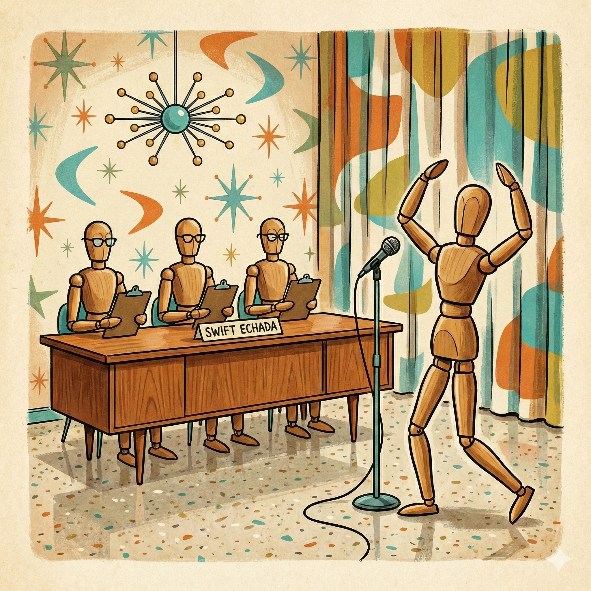

<p align="center">
    
</p>

# SwiftEchada

AI-powered cast management for screenplay projects. Generates on-device custom voices from text prompts (via [SwiftVoxAlta](https://github.com/intrusive-memory/SwiftVoxAlta)) and manages cast data in PROJECT.md files (via [SwiftProyecto](https://github.com/intrusive-memory/SwiftProyecto)).

## Requirements

- macOS 26+ (Apple Silicon)
- Swift 6.2+
- **MLX framework** (via Homebrew)

### Install MLX

SwiftEchada requires the MLX framework for on-device voice generation:

```bash
brew install mlx
```

This installs the compiled Metal shader library (`mlx.metallib`) required for GPU acceleration.

## Installation

### Homebrew

```bash
brew tap intrusive-memory/tap
brew install echada
```

### Swift Package (Library Only)

Add to your `Package.swift`:

```swift
dependencies: [
    .package(url: "https://github.com/intrusive-memory/SwiftEchada.git", from: "0.16.1"),
]
```

The library target depends only on [SwiftProyecto](https://github.com/intrusive-memory/SwiftProyecto) — all ML and voice dependencies are CLI-only.

## CLI Usage

The `echada` CLI has four top-level commands: `cast`, `generate`, `voice`,
and the hidden `test-voice`. There is no default subcommand — running bare
`echada` prints help; invoke a command explicitly.

### `echada cast` — the full pipeline

`echada cast` runs the whole production pipeline end to end:

```
PROJECT.md  →  generate cast  →  generate prompt  →  generate vox
```

If `--project` (default `PROJECT.md`) is absent, it is scaffolded automatically
from the surrounding directory (inferred title, author, `episodesDir`,
`filePattern`) with no LLM involved. Then it runs, in order: `generate cast`
(discover cast members from the screenplay source), `generate prompt` (write a
`voicePrompt` per member via the on-device Foundation Model), and `generate
vox` (synthesize an on-device `.vox` voice per member). Every stage is
idempotent, so re-running only fills the gaps.

```bash
echada cast [--project <path>] [--character <name>] [--tts-model <0.6b|1.7b>] [--language <bcp-47>]... [--accent <directive>] [--force] [--dry-run] [--verbose]
```

`--force` cascades to every stage's own force flag (cast re-sync, prompt
overwrite, vox regenerate). `--tts-model`, `--language`, and `--accent`
forward to the vox stage; `--character` forwards to the prompt and vox stages.
`--dry-run` runs the offline bootstrap + cast-discovery steps but stops before
the model-backed prompt and vox stages.

### `echada generate` — run a single stage

For fine-grained, per-stage control, each pipeline step is also available
standalone under the `generate` namespace:

```bash
echada generate cast [--project <path>] [--force] [--dry-run] [--verbose]
echada generate prompt [--project <path>] [--character <name>] [--force] [--dry-run] [--verbose]
echada generate vox [--project <path>] [--character <name>] [--tts-model <0.6b|1.7b>] [--language <bcp-47>]... [--accent <directive>] [--force-regenerate] [--dry-run] [--verbose]
```

- **`generate cast`** — heuristically discovers character names from the
  screenplay source (no LLM/ML) and merges them into PROJECT.md's `cast:`
  list, without clobbering existing `actor`/`voicePrompt`/`voices`/`language`
  fields unless `--force`.
- **`generate prompt`** — examines each cast member's dialogue and writes a
  `voicePrompt` via the on-device Foundation Model. Fills empty prompts only
  unless `--force`.
- **`generate vox`** — synthesizes an on-device `.vox` voice from each
  member's `voicePrompt` using Qwen3-TTS. This is what `echada cast` used to
  do on its own before this restructure. Uses a two-phase pipeline: **Phase
  A** — VoiceDesign 1.7B generates candidate WAVs from voice prompts; **Phase
  B** — Base model creates voice locks (speaker embeddings) and exports `.vox`
  bundles. `--language` may be repeated to cast multiple languages into one
  `.vox` (e.g. `--language es --language en`); `--accent` applies a delivery
  directive (e.g. `"slow southern drawl"`) to every character's voice.

### Generate a Voice

Generate a single `.vox` voice file from a text prompt (no PROJECT.md required).

```bash
echada voice "A warm female voice with a slight southern accent" --output my-voice.vox --name "Narrator"
```

Appends to existing `.vox` files for multi-model support.

### Migrating from pre-0.16 `echada`

This is a **breaking change** to the CLI surface (hard cut, no back-compat
alias):

| Old (pre-0.16) | New |
|-----------------|-----|
| `echada cast` (produced `.vox` only) | `echada generate vox` |
| `echada prompt` | `echada generate prompt` |
| `echada cast` (bare, no project) | `echada cast` now runs the **full pipeline** (bootstrap → cast → prompt → vox), not just `.vox` generation |

There is no runtime breadcrumb pointing you here: `echada prompt ...` now
fails with ArgumentParser's generic "unknown subcommand" error, and the old
`.vox`-only `cast` flag usage silently runs the full pipeline instead (since
`cast` was repurposed) rather than erroring. If a script or CI job invokes
`echada prompt` or expects `echada cast` to only touch `.vox` files, update it
to the table above.

## Library Usage

### Character Merging

```swift
import SwiftEchada
import SwiftProyecto

let merger = CharacterMerger()
let unified = merger.merge(
    extracted: [extractedFromFile1, extractedFromFile2],
    existingCast: currentCast
)
// unified contains deduplicated, sorted cast list
```

### Character Profiles

```swift
import SwiftEchada

let profile = CharacterProfile(
    name: "NARRATOR",
    gender: .male,
    ageRange: "40s",
    description: "A deep, authoritative voice with warmth",
    voiceTraits: ["deep", "authoritative", "warm"],
    summary: "Deep authoritative male narrator voice"
)
```

### Sample Sentences

Voice-audition sample sentences are sourced from Apple's on-device Foundation
Model, which produces a genuinely in-language sentence for the requested
language. Apple Intelligence must be enabled — there is no offline fallback.

```swift
// In the CLI (EchadaCLICore):
let sentence = try await FoundationModelSentence.auditionSentence(language: "es")
```

## Architecture

```
Library:  SwiftEchada → SwiftProyecto
CLI:      echada → SwiftEchada + SwiftVoxAlta + MLX
```

The library contains pure data types and utilities with no ML dependencies. Voice generation is entirely prompt-based — voice descriptions are text strings in PROJECT.md, and the CLI generates `.vox` files from these prompts with no LLM involvement.

## Building

```bash
# Build CLI
make build

# Run tests
make test

# Release build + copy to ./bin
make release

# Clean
make clean
```

All `make` targets use `xcodebuild` (required for Metal shader compilation).

## Related Projects

- [SwiftProyecto](https://github.com/intrusive-memory/SwiftProyecto) — Project metadata and file discovery
- [SwiftVoxAlta](https://github.com/intrusive-memory/SwiftVoxAlta) — On-device neural TTS voice generation
