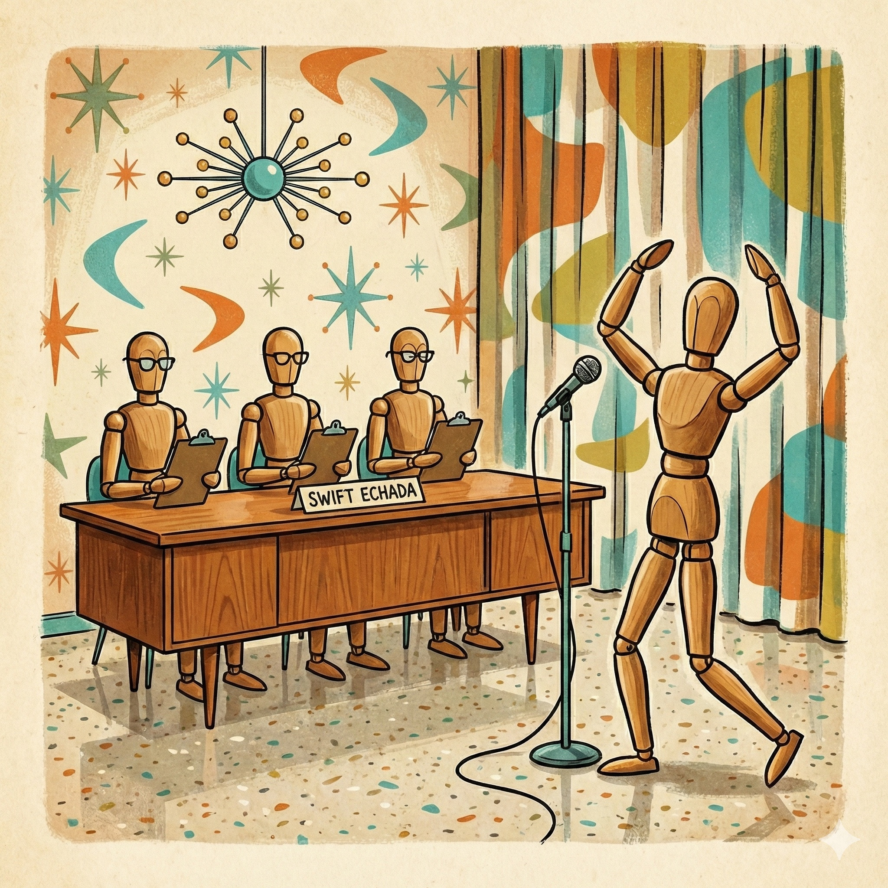

<p align="center">
    
</p>

# SwiftEchada

AI-powered cast management for screenplay projects. Generates on-device custom voices from text prompts (via [SwiftVoxAlta](https://github.com/intrusive-memory/SwiftVoxAlta)) and manages cast data in CAST.md files (via [SwiftReparto](https://github.com/intrusive-memory/SwiftReparto)).

**Ownership split (v1.0.0)**: `PROJECT.md` is [SwiftProyecto](https://github.com/intrusive-memory/SwiftProyecto)'s config file — project identity, episode discovery, TTS config. `CAST.md` is SwiftReparto's config file — the cast roster, voice prompts, and `.vox` voice pointers. All `echada` generate stages read and write `CAST.md`; a legacy `cast:` block in `PROJECT.md` is treated as read-only history, consulted only to seed a new `CAST.md` and to verify the migration, and removed only by the explicit `echada prune cast` command.

## Requirements

- macOS 26+ (Apple Silicon)
- Swift 6.2+
- **MLX framework** (via Homebrew)

### Install MLX

SwiftEchada requires the MLX framework for on-device voice generation:

```bash
brew install mlx
```

This installs the compiled Metal shader library (`mlx.metallib`) required for GPU acceleration.

## Installation

### Homebrew

```bash
brew tap intrusive-memory/tap
brew install echada
```

### Swift Package (Library Only)

Add to your `Package.swift`:

```swift
dependencies: [
    .package(url: "https://github.com/intrusive-memory/SwiftEchada.git", from: "1.0.0"),
]
```

The library target depends only on [SwiftReparto](https://github.com/intrusive-memory/SwiftReparto) — a leaf package that owns the CAST.md schema. All ML and voice dependencies (and SwiftProyecto, for project-level PROJECT.md fields) are CLI-only.

## CLI Usage

The `echada` CLI has six top-level commands: `cast`, `generate`, `verify`,
`prune`, `voice`, and the hidden `test-voice`. There is no default subcommand —
running bare `echada` prints help; invoke a command explicitly.

Every command that touches the cast roster accepts `--cast <filename>`
(default `CAST.md`): a bare filename resolved beside `--project` — path
separators are rejected.

### `echada cast` — the full pipeline

`echada cast` runs the whole production pipeline end to end:

```
PROJECT.md + CAST.md  →  generate cast  →  generate prompt  →  generate vox
```

If `--project` (default `PROJECT.md`) is absent, it is scaffolded automatically
from the surrounding directory (inferred title, author, `episodesDir`,
`filePattern`) with no LLM involved. The `--cast` roster file (default
`CAST.md`) is then ensured beside PROJECT.md — seeded from a legacy `cast:`
block when one is present, created empty otherwise; an existing roster is left
untouched. Then it runs, in order: `generate cast`
(discover cast members from the screenplay source), `generate prompt` (write a
`voicePrompt` per member via the on-device Foundation Model), and `generate
vox` (synthesize an on-device `.vox` voice per member). Every stage is
idempotent, so re-running only fills the gaps.

```bash
echada cast [--project <path>] [--cast <filename>] [--character <name>] [--tts-model <0.6b|1.7b>] [--language <bcp-47>]... [--accent <directive>] [--force] [--dry-run] [--verbose]
```

`--force` cascades to every stage's own force flag (cast re-sync, prompt
overwrite, vox regenerate). `--cast` forwards to all three stages;
`--tts-model`, `--language`, and `--accent`
forward to the vox stage; `--character` forwards to the prompt and vox stages.
`--dry-run` runs the offline bootstrap + cast-discovery steps but stops before
the model-backed prompt and vox stages.

### `echada generate` — run a single stage

For fine-grained, per-stage control, each pipeline step is also available
standalone under the `generate` namespace:

```bash
echada generate cast [--project <path>] [--cast <filename>] [--force] [--dry-run] [--verbose]
echada generate prompt [--project <path>] [--cast <filename>] [--character <name>] [--force] [--dry-run] [--verbose]
echada generate vox [--project <path>] [--cast <filename>] [--character <name>] [--tts-model <0.6b|1.7b>] [--language <bcp-47>]... [--accent <directive>] [--force-regenerate] [--dry-run] [--verbose]
```

- **`generate cast`** — heuristically discovers character names from the
  screenplay source (no LLM/ML) and merges them into the CAST.md roster,
  without clobbering existing `actor`/`voicePrompt`/`voices`/`language`
  fields unless `--force`. When CAST.md does not exist yet and PROJECT.md
  still carries a legacy `cast:` block, that roster seeds the new CAST.md
  verbatim before discovered characters are merged on top. PROJECT.md itself
  is never modified.
- **`generate prompt`** — examines each cast member's dialogue and writes a
  `voicePrompt` into CAST.md via the on-device Foundation Model. Fills empty
  prompts only unless `--force`.
- **`generate vox`** — synthesizes an on-device `.vox` voice from each
  member's `voicePrompt` using Qwen3-TTS, recording the output path under
  `voices.voxalta` in CAST.md (relative to CAST.md's directory). This is what
  `echada cast` used to
  do on its own before this restructure. Uses a two-phase pipeline: **Phase
  A** — VoiceDesign 1.7B generates candidate WAVs from voice prompts; **Phase
  B** — Base model creates voice locks (speaker embeddings) and exports `.vox`
  bundles. `--language` may be repeated to cast multiple languages into one
  `.vox` (e.g. `--language es --language en`); `--accent` applies a delivery
  directive (e.g. `"slow southern drawl"`) to every character's voice.

### `echada verify cast` and `echada prune cast` — the migration gates

Projects that predate v1.0.0 carry their roster in PROJECT.md's `cast:`
block. Migration is two-phase and non-destructive, with a human gate between
generation and removal:

```bash
echada generate cast            # 1. seed + build CAST.md (PROJECT.md untouched)
echada verify cast              # 2. read-only gate: rosters must agree
echada prune cast               # 3. explicit: excise the legacy cast: block
```

- **`verify cast`** — compares CAST.md against the legacy `cast:` in
  PROJECT.md and reports three divergence classes: characters present in one
  file and not the other, differing field values on a matched character, and
  `.vox` pointers in CAST.md that do not resolve to a file on disk. It never
  writes either file; it exits 0 on agreement and non-zero on any divergence,
  so it can gate CI or a rollout loop.
- **`prune cast`** — removes the legacy `cast:` block from PROJECT.md, the
  only write to PROJECT.md's cast data anywhere in `echada`. Two gates guard
  it: CAST.md must exist beside PROJECT.md, and `verify cast` must pass. Only
  the `cast:` line span is excised — every other byte of the file survives
  verbatim. Idempotent (`cast:`-less PROJECT.md exits 0), explicit-only (no
  other command ever invokes it), and `--dry-run` prints the removal diff
  without writing.

### Generate a Voice

Generate a single `.vox` voice file from a text prompt (no PROJECT.md required).

```bash
echada voice "A warm female voice with a slight southern accent" --output my-voice.vox --name "Narrator"
```

Appends to existing `.vox` files for multi-model support.

### Migrating from pre-0.16 `echada`

This is a **breaking change** to the CLI surface (hard cut, no back-compat
alias):

| Old (pre-0.16) | New |
|-----------------|-----|
| `echada cast` (produced `.vox` only) | `echada generate vox` |
| `echada prompt` | `echada generate prompt` |
| `echada cast` (bare, no project) | `echada cast` now runs the **full pipeline** (bootstrap → cast → prompt → vox), not just `.vox` generation |

There is no runtime breadcrumb pointing you here: `echada prompt ...` now
fails with ArgumentParser's generic "unknown subcommand" error, and the old
`.vox`-only `cast` flag usage silently runs the full pipeline instead (since
`cast` was repurposed) rather than erroring. If a script or CI job invokes
`echada prompt` or expects `echada cast` to only touch `.vox` files, update it
to the table above.

## Library Usage

### Character Merging

```swift
import SwiftEchada
import SwiftReparto

let merger = CharacterMerger()
let unified = merger.merge(
    extracted: [extractedFromFile1, extractedFromFile2],
    existingCast: castDocument.cast  // [SwiftReparto.CastMember], from CAST.md
)
// unified contains deduplicated, sorted cast list
```

### Character Profiles

```swift
import SwiftEchada

let profile = CharacterProfile(
    name: "NARRATOR",
    gender: .male,
    ageRange: "40s",
    description: "A deep, authoritative voice with warmth",
    voiceTraits: ["deep", "authoritative", "warm"],
    summary: "Deep authoritative male narrator voice"
)
```

### Sample Sentences

Voice-audition sample sentences are sourced from Apple's on-device Foundation
Model, which produces a genuinely in-language sentence for the requested
language. Apple Intelligence must be enabled — there is no offline fallback.

```swift
// In the CLI (EchadaCLICore):
let sentence = try await FoundationModelSentence.auditionSentence(language: "es")
```

## Architecture

```
Library:  SwiftEchada → SwiftReparto (CAST.md schema — a leaf package)
CLI:      echada → EchadaCLICore → SwiftEchada + SwiftReparto + SwiftProyecto + SwiftVoxAlta + MLX
```

The library contains pure data types and utilities with no ML dependencies. SwiftReparto is the single writer of CAST.md — `echada` mutates a `CastDocument` and hands it back for serialization. SwiftProyecto appears only in the CLI, for project-level PROJECT.md fields (`title`, `episodesDir`, `filePattern`, `tts.model`). Voice generation is entirely prompt-based — voice descriptions are text strings in CAST.md, and the CLI generates `.vox` files from these prompts with no LLM involvement.

## Building

```bash
# Build CLI
make build

# Run tests
make test

# Release build + copy to ./bin
make release

# Clean
make clean
```

All `make` targets use `xcodebuild` (required for Metal shader compilation).

## Related Projects

- [SwiftReparto](https://github.com/intrusive-memory/SwiftReparto) — CAST.md schema, parser, and serializer (cast roster ownership)
- [SwiftProyecto](https://github.com/intrusive-memory/SwiftProyecto) — Project metadata and file discovery (PROJECT.md ownership)
- [SwiftVoxAlta](https://github.com/intrusive-memory/SwiftVoxAlta) — On-device neural TTS voice generation
